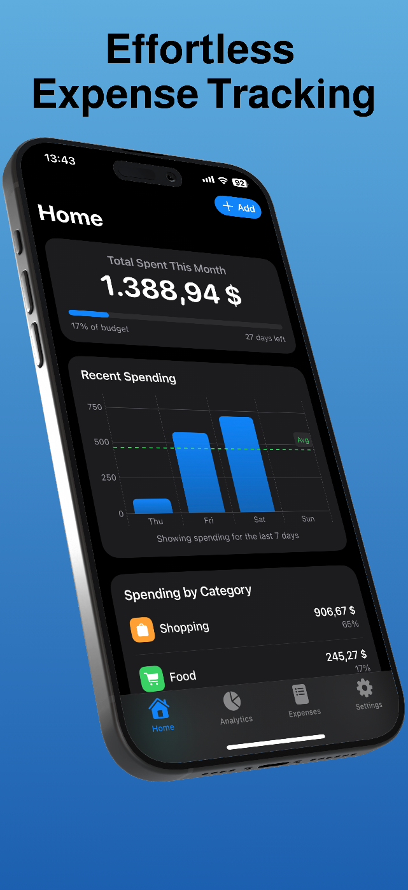
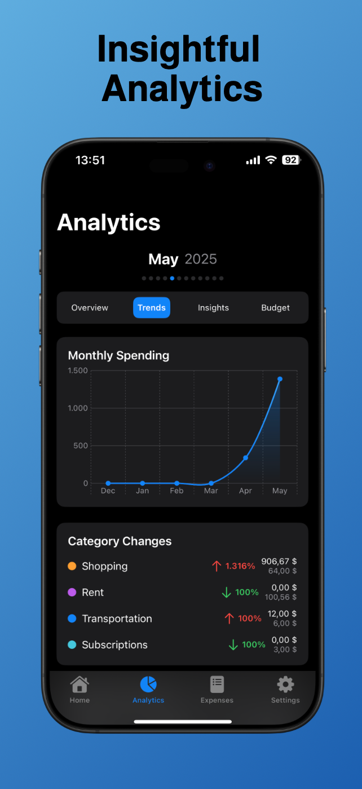
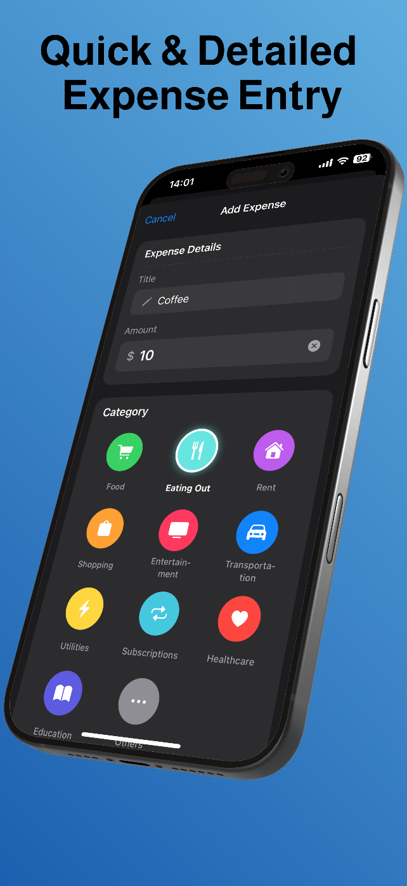

# Inpenso

<p align="center">
  <kbd>
    
  </kbd>
</p>

A modern, intuitive expense tracker for iOS that helps you monitor spending, set budgets, and visualize your financial habits through beautiful analytics.

## Features

- 📊 **Smart Analytics**: Visualize your spending patterns by category, month, and trends
- 💰 **Budget Management**: Set monthly budgets and track your progress
- 🔔 **Home Screen Widgets**: Monitor your expenses directly from your home screen
- 📱 **iOS Integration**: Clean SwiftUI design that follows Apple's HIG
- 🔄 **Siri Shortcuts**: Add expenses quickly with voice commands
- 🔒 **Privacy-Focused**: All your data stays on your device

## Screenshots

<table>
  <tr>
    <td></td>
    <td></td>
    <td></td>
  </tr>
</table>

## Requirements

- iOS 16.0+
- Xcode 15.0+
- Swift 5.9+

## Installation

1. Clone the repository:
```bash
git clone https://github.com/VintusS/Inpenso.git
```

2. Open `Inpenso.xcodeproj` in Xcode.

3. Build and run the app on your iOS device or simulator.

## Architecture

Inpenso follows the MVVM (Model-View-ViewModel) architecture pattern:

- **Models**: Data structures representing expenses, categories, and budgets
- **Views**: SwiftUI views for user interface
- **ViewModels**: Business logic that connects models to views
- **Services**: Handles data persistence and shared functionalities

## Contributing

Contributions are welcome! If you'd like to contribute, please follow these steps:

1. Fork the repository
2. Create your feature branch (`git checkout -b feature/amazing-feature`)
3. Commit your changes (`git commit -m 'Add some amazing feature'`)
4. Push to the branch (`git push origin feature/amazing-feature`)
5. Open a Pull Request

Please read the [CONTRIBUTING.md](CONTRIBUTING.md) for details on our code of conduct and the process for submitting pull requests.

## License

This project is licensed under the MIT License - see the [LICENSE](LICENSE) file for details.

## Acknowledgments

- Thanks to all contributors who have helped shape Inpenso
- Icons provided by SF Symbols
- Inspiration from other personal finance apps

## Contact

Dragomir Mindrescu - [@VintusS](https://github.com/VintusS)

Project Link: [https://github.com/VintusS/Inpenso](https://github.com/VintusS/Inpenso)

## Topics

ios swift swiftui expense-tracker personal-finance budget-app analytics data-visualization mobile-app productivity tools 